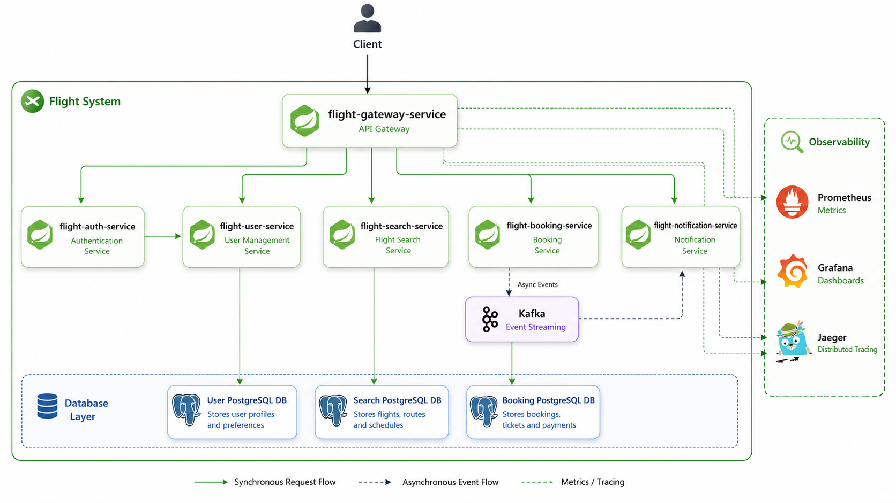
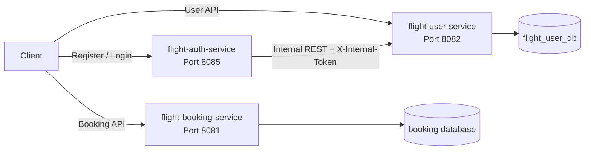
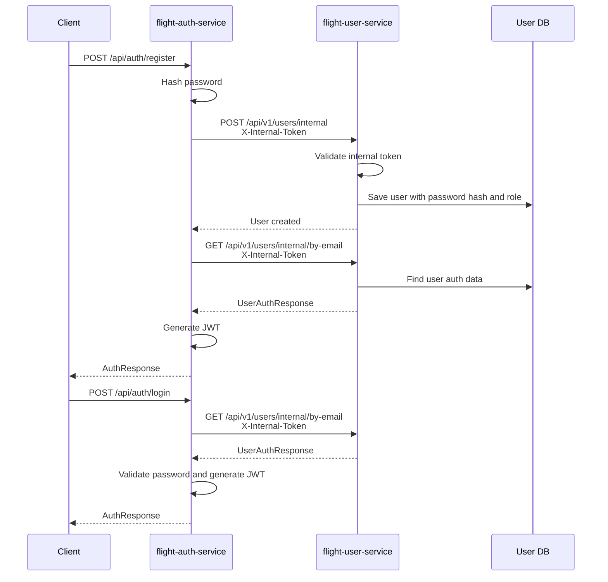
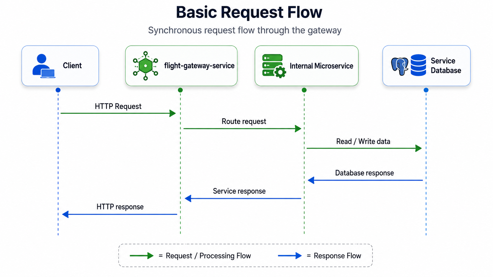
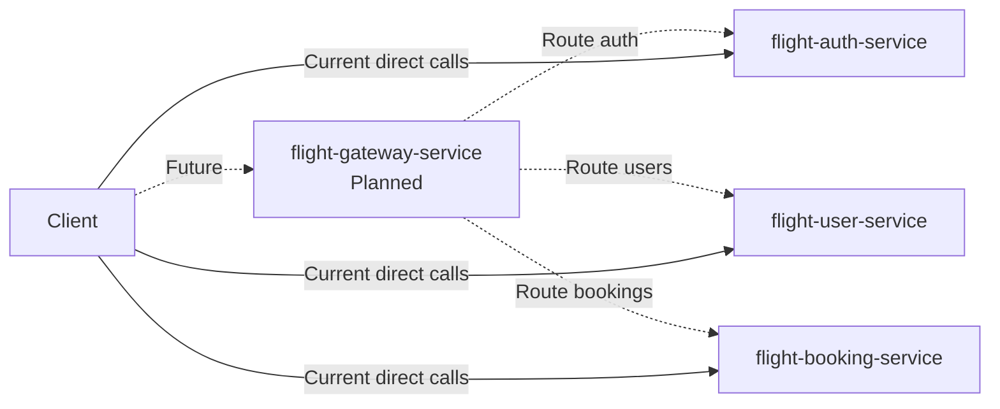

# Flight Booking System

A learning-focused **microservices-based Flight Booking System** built with the **Java Spring ecosystem**.

The project is inspired by [`sweelam/flight-system`](https://github.com/sweelam/flight-system), but it is being built
from scratch to understand each layer, pattern, and architectural decision.

---

## Tech Stack

- Java
- Spring Boot
- Spring Data JPA / Hibernate
- PostgreSQL
- Flyway
- Lombok
- MapStruct
- Spring Security / JWT
- Docker / Docker Compose

---

## System Architecture

The current system is split into three Spring Boot services:

- `flight-auth-service` handles registration, login, password hashing, and JWT generation.
- `flight-user-service` owns user profile and auth lookup data.
- `flight-booking-service` owns booking data.

Auth does not store users directly. During registration and login it calls protected internal endpoints in
`flight-user-service`. Those internal endpoints require the shared `X-Internal-Token` header, configured by
`INTERNAL_SERVICE_TOKEN` in both services.





---

## Services

| Service                  | Port | Status      | Responsibility                                                |
|--------------------------|------|-------------|---------------------------------------------------------------|
| `flight-auth-service`    | 8085 | Implemented | Registration, login, password hashing, JWT generation         |
| `flight-user-service`    | 8082 | Implemented | User profiles, auth user lookup, internal user creation       |
| `flight-booking-service` | 8081 | Implemented | Booking management                                            |
| `flight-gateway-service` | TBD  | Planned     | Single entry point, request routing, JWT validation           |
| `flight-search-service`  | TBD  | Planned     | Flight search                                                 |
| Notification service     | TBD  | Planned     | Asynchronous booking notifications, likely through Kafka      |

---

## Auth Request Flow

The auth service delegates user persistence and lookup to the user service through protected internal endpoints.



---

## Basic Request Flow

Until the gateway service is added, clients call the services directly. Once the gateway is implemented, most external
requests should enter through the gateway and be routed to the correct internal service.





---

## Project Structure

```text
flight-system
├── flight-booking-service
├── flight-user-service
├── flight-auth-service
├── docs
└── docker-compose.yml
```

Example service structure:

```text
src/main/java/org/learnjava/flightsystem/user
├── api
├── dto
├── entity
├── exceptions
├── mapper
├── repo
├── service
└── FlightUserServiceApplication.java
```

---

## Configuration Notes

- `flight-auth-service` reads the user service URL from `services.user-service.base-url`.
- `flight-auth-service` and `flight-user-service` must use the same `INTERNAL_SERVICE_TOKEN`.
- `flight-auth-service` signs JWTs with `JWT_SECRET_KEY`.
- The current local database settings are in each service's `application.yaml`.


This project is still under active development.
