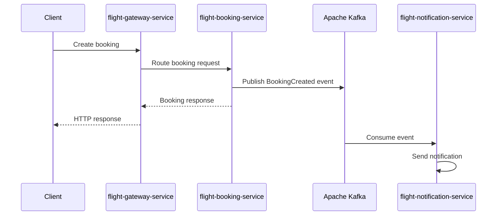

# Flight Booking System

A learning-focused **microservices-based Flight Booking System** built with the **Java Spring ecosystem**.

The project is inspired by [`sweelam/flight-system`](https://github.com/sweelam/flight-system), but it is being built
from scratch to understand each layer, pattern, and architectural decision.

---

## Tech Stack

- Java
- Spring Boot
- Spring Data JPA / Hibernate
- PostgreSQL
- Flyway
- Lombok
- MapStruct
- Spring Security / JWT
- Spring Cloud Gateway
- Apache Kafka
- Docker / Docker Compose
- Prometheus / Grafana / Jaeger

---

## System Architecture

The system is divided into small services. Each service has one main responsibility and owns its own database.


---

## Services

| Service                       | Responsibility                             |
|-------------------------------|--------------------------------------------|
| `flight-gateway-service`      | Single entry point and request routing     |
| `flight-auth-service`         | Registration, login, password hashing, JWT |
| `flight-user-service`         | User profile data                          |
| `flight-search-service`       | Flight search                              |
| `flight-booking-service`      | Booking management                         |
| `flight-notification-service` | Kafka-based notifications                  |

---

## Basic Request Flow

Most requests enter through the gateway, then the gateway routes the request to the correct internal service.


---

## Booking Event Flow

Booking notifications are handled asynchronously using Kafka.



---

## Project Structure

```text
flight-system
├── flight-booking-service
├── flight-user-service
├── flight-auth-service
├── flight-search-service
├── flight-gateway-service
├── flight-notification-service
└── docker-compose.yml
```

Example service structure:

```text
src/main/java/org/learnjava/flightsystem/user
├── api
├── dto
├── entity
├── exceptions
├── mapper
├── repo
├── service
└── FlightUserServiceApplication.java
```

---


This project is still under active development.